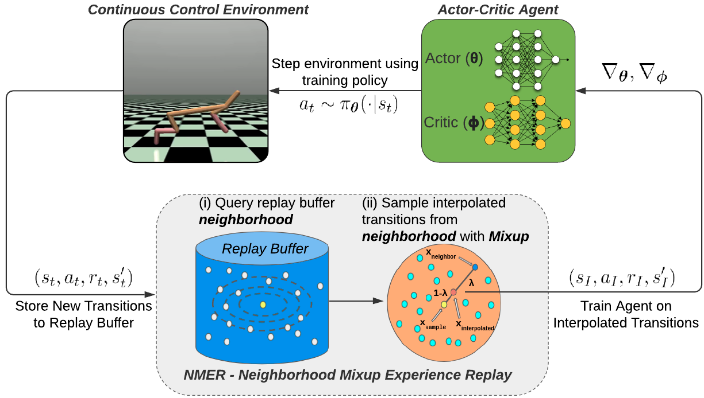

# Neighborhood Mixup Experience Replay (NMER)

NMER is a novel off-policy data augmentation technique designed to improve the sample efficiency of deep reinforcement learning agents in continuous control tasks.


## Code Release
Code release coming soon!

## Paper
Please find 2021 NeurIPS Deep RL Workshop **[paper](https://openreview.net/pdf?id=jp9NJIlTK-t)**, as well as our supplementary **[technical report](https://rmsander.github.io/projects/nmer_tech_report.pdf)**. 

If you find NMER useful, please consider citing our paper as:

```
@inproceedings{
  sander2021neighborhood,
  title={Neighborhood Mixup Experience Replay: Local Convex Interpolation for Improved Sample Efficiency in Continuous Control Tasks},
  author={Ryan Sander and Wilko Schwarting and Tim Seyde and Igor Gilitschenski and Sertac Karaman and Daniela Rus},
  booktitle={Deep RL Workshop NeurIPS 2021},
  year={2021},
  url={https://openreview.net/forum?id=jp9NJIlTK-t}
}
```

## Acknowledgements
This research was supported by the Toyota Research Institute (TRI). This article solely reflects the opinions and conclusions of its authors and not TRI,
Toyota, or any other entity. We thank TRI for their support. The authors thank the MIT SuperCloud and Lincoln Laboratory Supercomputing Center for providing HPC and consultation resources that have contributed to the research results reported within this publication. 
